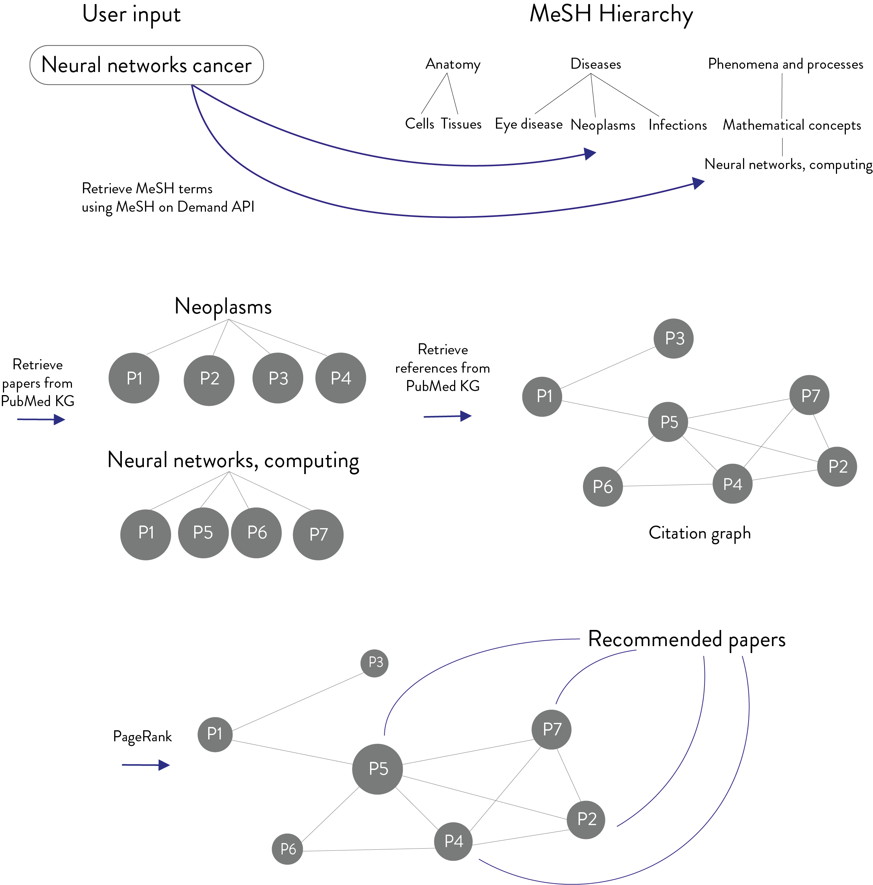

# Pubmed Explorer



## About
The PubMed explorer is designed to be a useful tool for promising students aiming to start a Ph.D. to explore new topics and to find a department and supervisor at the forefront of their field of interest. The tool provides a simple interface, whereby a user can input text or keywords. The input is then used to obtain the corresponding keywords and research field, and the most influential papers in the field as well information regarding 
key authors and departments. In addition, a summary for each paper, computed using a Transfomer model operating on the paper's summary, is provided for the user to get an idea of each paper's content at a glance.
Enhanced visualization is provided, optionally, whereby the user can visualize keywords and papers in a 2D space where distances are indicative of paper-paper and paper-keyword similarities.

## Installation

### Install Manually

```bash
# Create conda environment
conda create --name pubmed python=3.7

# Activate the environment
conda activate pubmed

# Install packages
conda install pytorch==1.6.0 torchvision==0.7.0 cudatoolkit=10.1 -c pytorch
pip install dash==1.19.0
pip install networkx==2.4
pip install pandas==1.0.3
pip install pymysql==1.0.2
pip install simplejson==3.17.2
pip install scikit-learn==0.23.2
pip install transformers==4.4.2

# Compile Java script
cd keyword_matching/SKR_Web_API_V2_4/examples
../compile.sh GenericBatchUser.java
```

## Data

### Official Datasets

The pubmed database is available [here](http://er.tacc.utexas.edu/datasets/ped).

## Usage

### Run dashboard locally

```bash
cd keyword_matching/SKR_Web_API_V2_4/examples
python dash_app.py
```


## Questions

If you have any questions, please create an issue [here](https://github.com/ggonzalezp/pubmedkg_recommender/issues/new).
